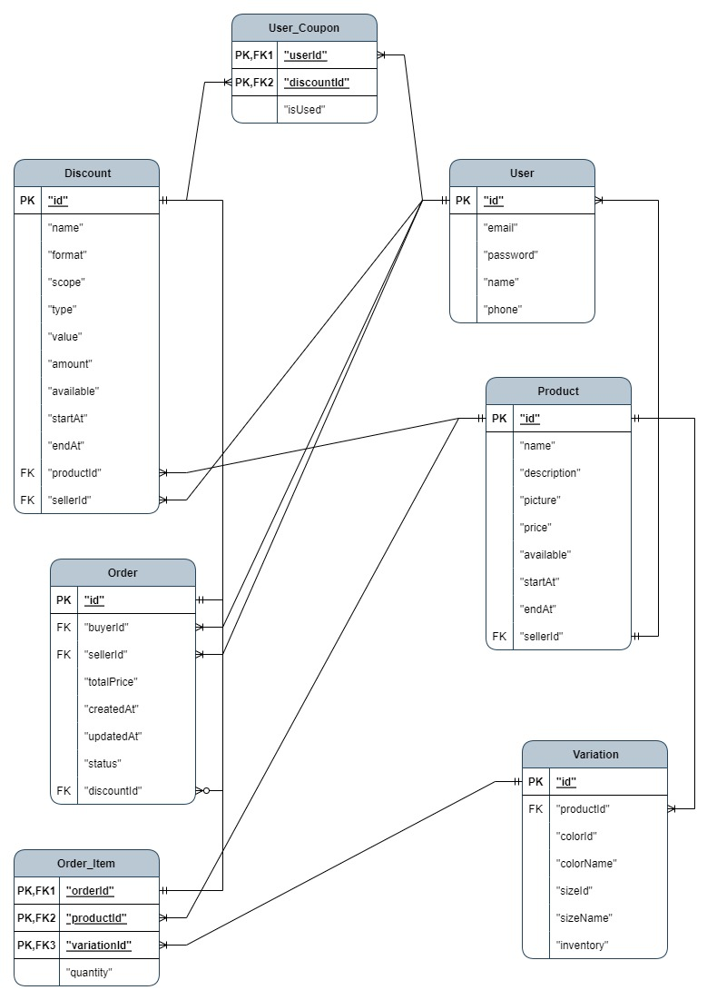

# Clothing e-commerce platform

## Getting Started

1. to run the development server:

```bash
npm i
npm run dev
```

Open [http://localhost:3000](http://localhost:3000) with your browser to see the result.

2. `.db` file located at `./prisma/ecomm.db`

## Database Design

### ER model



### Table Description

1. User：用戶資訊
2. Order：訂單資訊
3. Product：產品資訊
4. Variation：產品的顏色及尺碼
5. Discount：優惠券及活動
6. User_Coupon 用戶持有的優惠券
7. Order_Item 訂單中詳細購買商品

### Violation of Normal Forms

1. `totalPrice` in `Order`： (1) 交易金額重要性高且常用的項目，不應該每次重新計算，(2) 以平台使用情境可能會調整商品售價，應該直接紀錄交易當下的金額。
2. `sellerId` in `Order`：為了API中方便查詢特定賣家的訂單，為了避免多表查詢，所以直接儲存`sellerId`。
3. `productId` in `Order_Item`：為了呈現，常常需要取得`product`資料，為了避免多表查詢，所以直接儲存`productId`。
4. `colorId/colorName` & `sizeId/sizeName` in `Variation`：(1) 為了符合 API 規定的 Responses 中有`colorId`及`sizeId`，所以才儲存這兩個項目，實際上我認為`colorName`和`sizeName`應該綁定成一組，自己是一個 variation，剛好對應到一個`inventory`。(2) 在使用上獨立查詢 size 或 color 機會很少，分開反而要多一次 query。

## Future Works

### Front-end

1. 除了登入及註冊外，目前前端只完成資料展示（GET）的部分，未完成更新（PATCH）、新增（POST）等功能，此外，預計還要完成搜尋、購物車、wishlist、full-duplex 等功能。

2. 有些頁面的轉跳還沒完成（e.g. 已登入的使用者還是能透過 URL 跳到登入頁面）。

3. 這次使用 Next.js，他支援 Server Side Rendering 及 Static Side Generation，但是可能由於(1)電腦配備不夠好、(2)某些頁面讀取前需要先做 SQL Query，感覺速度有點不理想（但基本上都<800ms）。需要再深入去了解 Next.js 處理 rendering 的相關資訊，瞭解是否能夠再降低使用時的不連續感。

4. 為了達到 redux persist store 的功能，我會將一些資料存在 client side 的 local storage。目前儲存了 user & product info，user 是為了一直保持登入，但目前還沒有設置一個妥當的過期時間。而 product info 則是想要減少每次瀏覽頁面時的 fetch 次數，但對於 product 量很大時，也許有更好的辦法，另外更新 store 的時間也需要再考慮。

### Database

1. 因為將 product 和它的 variation 分成兩章表儲存，在處理 product 相關的 API，一次 fetch 最高會需要執行 4 次 SQL statements。當初是考量到每個商品的 variation 的數量不一，才將兩者拆開，但有鑑於 Clothing e-commerce platform 的特質，上架商品後，未來在相同商品上新增新尺碼色號的可能性較低，且 variation 的數量通常不會超過幾十個，可能配合記憶體設定固定數量上限，合併成一個 table 會更好。

2. 當初認為 coupon 跟 activity 的結構非常類似，所以將兩者合併為 discount，可以一次查詢所有可套用優惠，但實際上分開使用的情況較多，如此一來還要多存一個欄位，應該拆開成兩個 table更直觀。

3. 為了達到更好的展示效果，應該要對 product name 的長度做限制。
